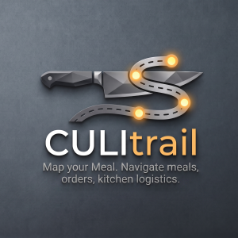

# CULItrail

<div align="center">
   
</div>

## Overview

A [Technosoftware GmbH](https://technosoftware.com) product. It works alone,
and it cooperates with the plugins in
[TRAILsuite](https://github.com/technosoftware-gmbh/TRAILsuite) by reading the
notes and settings they leave in the vault -- never by importing from them.

**Every meal you order ready-made, as plain Markdown.**

CULItrail is an Obsidian plugin for the meals a household buys ready-made
from a company and reheats at home: a structured meal view with the
reheating instructions per appliance, a searchable gallery, per-person
weekly meal planning, eating history, and
order tracking with an invoice view for what each order cost and who chose
what.

There is no cooking in it. A meal note carries what the dish is, what it
costs, what is in it and how to warm it up, not a list of ingredients and a
method, because that is not the question this plugin is asked.

Your notes are always the source of truth. Every view is derived from the
vault on each render, so nothing can silently drift out of step with what is
on disk. The one exception, a rebuild-on-demand mirror of the meal-plan
entries, is documented and has an explicit resync path.

## Areas

The vault, and the plugin's own source, are organized as five areas, so the
plugin can grow one piece at a time instead of as one flat pile:

```
Eating/
  Meals/                    one note per meal
  Meal Plans/               one note per person per ISO week
  Orders/                   one note per order
  Deliveries/               one note per box that arrived
CRM/
  People/ Companies/
```

| Area | What it covers |
|---|---|
| **Meals** | The meal note, the structured view, the gallery, eating history, the badges and the reheating section |
| **Planning** | Per-person weekly meal plans, keyed by ISO week, and the eating history their entries record |
| **Orders** | What was ordered from which company, per person, and the invoice view an order note opens in |
| **Deliveries** | What actually arrived, and when. An order is a purchase; a delivery is the freezer |
| **CRM** | Person and Company notes, read out of `CRM/People` and `CRM/Companies`. Read only: CULItrail keeps no contact registry and creates no contact notes |

`Eating` and `CRM` sit at the vault root out of the box. One optional
common-parent setting moves both together, so a vault that keeps everything
under `4 Resources/Eating` is one field away.

## Standalone, and better together

CULItrail needs nothing else installed and degrades in no way on its own.

When [APERtrail](https://github.com/technosoftware-gmbh/TRAILsuite)
is also present, the two plugins **read the same Person and Company notes**: same folders,
same `type:` values, same tag properties, all by default in both English and
German. Neither depends on the other at runtime and neither imports the
other's code. They agree through the vault, which is the only place two
Obsidian plugins should have to agree.

A person note in such a vault carries two blocks, `culi-related-orders` and
`travel-related-trips`, each answering its own plugin's question about that
person.

## Where CULItrail came from

CULItrail is deliberately a plugin of its own rather than one module of a
larger one, for the same reason travel is: a plugin scoped to a single area
can evolve on its own release cycle without dragging the rest of a vault
along. APERtrail keeps trips and places, CULItrail keeps the kitchen.

The meal code was built on the GPL-3.0
[Recipe Box](https://github.com/AdamArcane/obsidian-recipebox) plugin by
Arcane Tech / AdamArcane rather than rebuilt from scratch. See `NOTICE.md`.

## Documentation

Start at [docs/index.md](docs/index.md).

| If you want to... | Read |
|---|---|
| Install it, or try it on the sample vault | [Installation](docs/installation.md) |
| Walk through a first planned week | [Usage](docs/usage.md) |
| Understand meals, the meal view, the gallery and eating history | [Meals](docs/features/meals.md) |
| Understand per-person weekly meal planning | [Meal planning](docs/features/meal-planning.md) |
| Understand orders, people and companies | [Orders, people & companies](docs/features/orders-and-crm.md) |
| See how a bought dish gets its reheating instructions | [Ready meals](docs/design/ready-meals.md) |
| See the full settings surface | [Settings reference](docs/design/settings-reference.md) |
| Understand the note conventions it reads | [Data model](docs/design/data-model.md) |
| See how the plugin is put together | [Architecture](docs/design/architecture.md) |
| See the sample vault it is shaped around | [Sample vault](docs/design/sample-vault.md) |
| Copy a starting shape for a note | [Templates](docs/templates/index.md) |

## Build

```
npm install     # dependencies, including @technosoftware/trail-core from npm
npm run check   # typecheck, lint and the suite
npm run build   # typecheck + production build + lint, into main.js here
```

Also `npm run dev` for a watch build, and `npm run test`, `npm run lint` and
`npm run lint:fix` on their own.

The shared library
[`@technosoftware/trail-core`](https://www.npmjs.com/package/@technosoftware/trail-core)
is an ordinary npm dependency. It is MIT, it is developed in
[TRAILsuite](https://github.com/technosoftware-gmbh/TRAILsuite), and it cannot
be edited from this checkout: a change there is a release there and a version
bump here.

`./scripts/install-into-vault.sh /path/to/Vault` copies the built `main.js`,
`styles.css` and `manifest.json` into `.obsidian/plugins/culitrail/`.

## License

Copyright (c) 2026 Technosoftware GmbH, Switzerland. GPL-3.0-or-later. See
[LICENSE](LICENSE) and [NOTICE.md](NOTICE.md).

This differs from APERtrail and NODAtrail, which are PolyForm Noncommercial.
The GPL applies here because the meal code descends from the GPL-3.0-or-later
Recipe Box plugin, so it is inherited rather than chosen, and code must not be
copied from here into either of them.
